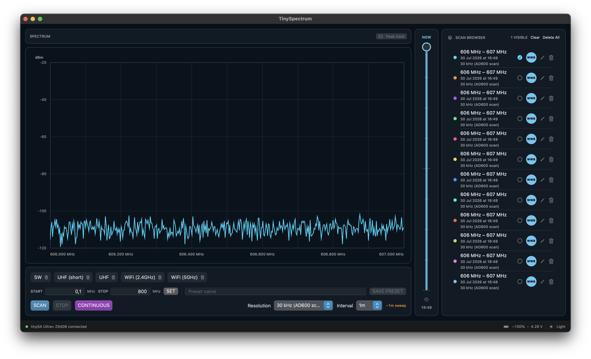
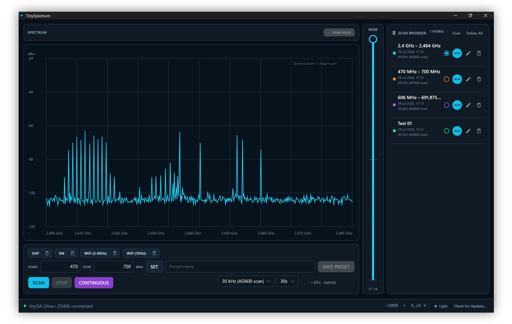
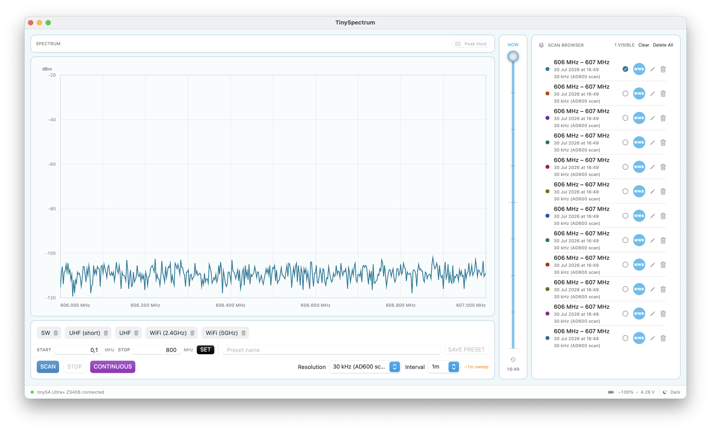
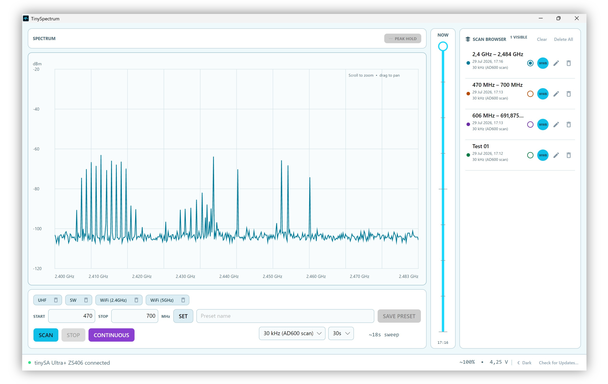

# TinySpectrum

<p align="center">
  <strong>A modern macOS and Windows spectrum scanner for tinySA Ultra.</strong><br>
  Scan, compare, monitor, and export RF activity without sending your measurements to the cloud.
</p>

<p align="center">
  <a href="https://github.com/iron-LAN/TinySpectrum/releases/latest"></a>
  <a href="https://github.com/iron-LAN/TinySpectrum/releases/latest"></a>
  <a href="https://github.com/iron-LAN/TinySpectrum/releases/latest"></a>
  
</p>

TinySpectrum turns a tinySA Ultra into a focused desktop scanning tool. It connects automatically over USB, keeps scan history locally, supports continuous timeline capture, and exports measurements for Shure Wireless Workbench.

## Device compatibility

| Device | Status | Notes |
| --- | --- | --- |
| tinySA Ultra ZS405 | **Confirmed working** | Tested with the current stable macOS and Windows releases. |
| tinySA Basic | **Supported, testing requested** | Device-specific limits and scan commands are included, but wider physical-device testing is still requested. |
| tinySA Ultra+ ZS406 | **Confirmed working** | Tested over USB on macOS and Windows, including Ultra mode scanning up to 6 GHz. |
| tinySA Ultra+ ZS407 | **Supported, testing requested** | Detected automatically with its reported model range; wider physical-device testing is still requested. |

If you test a device marked “testing requested,” please include its model, firmware version, operating system, selected range, and input connector when reporting the result.

## Interface

<table>
  <tr>
    <td width="50%" align="center"><strong>macOS</strong></td>
    <td width="50%" align="center"><strong>Windows</strong></td>
  </tr>
  <tr>
    <td></td>
    <td></td>
  </tr>
  <tr>
    <td></td>
    <td></td>
  </tr>
</table>

## Highlights

- **Automatic tinySA discovery** — connect by USB and TinySpectrum finds the serial device for you.
- **Single and continuous scanning** — capture one sweep or build a time-based RF survey.
- **Adaptive scan intervals** — choose 10 seconds, 30 seconds, 1 minute, 5 minutes, 10 minutes, or 30 minutes.
- **Resolution-aware timing** — interval and RBW selections adjust each other using the selected frequency span and estimated sweep duration.
- **Timeline playback** — move through every capture in a continuous session and inspect when activity appeared.
- **Trace modes** — draw a continuous session live, with cumulative Max Hold, or averaged, layered over the current sweep.
- **Adjustable vertical scale** — set the reference level and range, fit them to what is on screen, and see when a signal is stronger than the graph can show.
- **Visible scan countdown** — a circular timer shows when the next continuous capture will begin.
- **Multiple scan overlays** — compare saved scans using distinct trace colors.
- **Clear continuous timelines** — only one continuous session is displayed at a time, while regular scans remain available as comparison overlays.
- **Spectrum zoom and pan** — scroll over the graph to zoom around the pointer, then drag horizontally to inspect another part of the visible scan range.
- **Detailed frequency axis** — exact viewport edges and collision-free intermediate MHz labels remain readable down to 25 kHz steps.
- **Reusable presets** — save frequently scanned frequency ranges for one-click recall.
- **Wireless Workbench export** — export regular scans as WWB-compatible CSV and continuous sessions as `.sdb3` timeline data with one antenna curve.
- **Private by design** — scans and presets remain on your computer; approximate location on macOS is used only for optional city-based export filenames.
- **Scan library tools** — rename individual scans, export them with the custom name, or delete one or all saved scans.
- **Built-in updates** — both apps check for stable releases and can install new TinySpectrum versions from inside the app.
- **Light and dark appearance** — switch themes without leaving the scanner.

## Continuous RF surveys

Choose a frequency range, resolution, and interval, then select **Continuous**. TinySpectrum performs repeated sweeps, adds each capture to the timeline, and shows a countdown between scans.

Resolution and interval are linked:

- Choosing an **interval** selects the finest RBW expected to fit that scan cadence.
- Choosing a **resolution** selects the shortest available interval expected to accommodate the sweep.
- Changing the **frequency span** recalculates the estimate automatically.

Narrower RBW settings provide more frequency detail but can take considerably longer over a wide span. The displayed sweep time is an estimate; actual timing depends on tinySA firmware, mode, and scan conditions.

## Trace modes

Pick how the continuous session on screen is drawn from the control above the spectrum graph. The current sweep always stays visible; Max Hold and Average are layered over it.

| Mode | Overlay |
| --- | --- |
| Live | None, just the current sweep |
| Max Hold | A red line holding the strongest value seen at every frequency |
| Average | A dashed line showing the mean level at every frequency |

Both overlays accumulate up to wherever the timeline is parked, so scrubbing back through a session shows what the overlay looked like at that moment. Lower readings never reduce a held peak, while later higher readings update only the affected frequencies. Each scan remembers its own mode.

## Vertical scale

**REF** sets the level drawn at the top of the graph and **RANGE** sets how many decibels it spans. The defaults match the fixed window used before 3.0, and **AUTO** fits both to the scans on screen.

A sample stronger than the reference level cannot be drawn in place, so the graph marks those frequencies along its top edge and shows an **ABOVE REF** badge while any are hidden. Without it, a clipped signal looks exactly like a genuine flat-topped one.

## Spectrum navigation

Scroll vertically on the trackpad while the pointer is over the spectrum graph to zoom along the frequency axis. The zoom remains centered around the pointer and never extends beyond the combined range of the visible scans.

While zoomed in, drag left or right inside the graph to inspect another part of the scan. Panning is horizontal only. The frequency axis always shows the exact visible start and end, adds intermediate labels when space permits, and uses a minimum labeled step of 0.025 MHz.

## Wireless Workbench export

The **WWB** button adapts to the selected scan type:

| Scan type | Export | Contents |
| --- | --- | --- |
| Single scan | `.csv` | Frequency in MHz and amplitude in dBm |
| Continuous scan | `.sdb3` | Shure timeline container with timestamps and one antenna curve |

Continuous exports preserve the captured timeline so it can be played inside Wireless Workbench. Export filenames begin with the scan date and approximate city in `DD-MM-YY_LOCATION_` format, leaving the trailing underscore ready for your own description.

## Install

1. Download the newest macOS or Windows package from [Releases](https://github.com/iron-LAN/TinySpectrum/releases/latest).
2. Extract `TinySpectrum.app` and move it to `/Applications`.
3. Connect the tinySA Ultra directly over USB.
4. Close any other software using its serial port, then open TinySpectrum.

The current release is ad-hoc signed. On first launch, macOS may require confirmation in **System Settings → Privacy & Security** because the app is not yet notarized with an Apple Developer ID.

TinySpectrum requires **macOS 13 Ventura or newer**, or **Windows 10/11 x64**. The Windows archive is self-contained; extract it and run `TinySpectrum.exe`.

## Quick start

1. Start the tinySA normally in USB serial/console mode—not firmware-update mode.
2. Connect it to the Mac and wait for the green connection indicator.
3. Select a preset or enter a start and stop frequency.
4. Choose **Scan** for a single sweep or **Continuous** for a timeline.
5. Choose **Max Hold** above the graph to retain the strongest signals.
6. Select **WWB** beside a saved scan when you are ready to export.

Scans and custom presets are stored at:

```text
~/Library/Application Support/TinySpectrum/scans.json
```

## Supported resolution bandwidths

TinySpectrum exposes the manual RBWs supported by tinySA Ultra firmware:

`200 Hz` · `1 kHz` · `3 kHz` · `10 kHz` · `30 kHz` · `100 kHz` · `300 kHz` · `600 kHz` · `850 kHz`

TinySpectrum enables Ultra mode over USB when it detects an Ultra-family device, then selects the scan ceiling from the model information returned at connection time: 6 GHz for ZS405/ZS406 and 7.3 GHz for ZS407. It applies the documented 3–600 kHz RBW and 290-point limits when it detects a tinySA Basic. Hardware capabilities and calibrated ranges can differ by model and firmware.

## Build from source

Requirements:

- macOS 13 or newer
- Xcode Command Line Tools with Swift 6

```sh
git clone https://github.com/iron-LAN/TinySpectrum.git
cd TinySpectrum
chmod +x scripts/build-app.sh
./scripts/build-app.sh
cp -R dist/TinySpectrum.app /Applications/
```

Run the test suite with:

```sh
swift test
```

## Updates and releases

Stable releases are built by GitHub Actions and published together on one [Releases page](https://github.com/iron-LAN/TinySpectrum/releases): a signed Sparkle-compatible macOS archive and a self-contained Windows x64 archive.

Inside TinySpectrum, use **Check for Updates…** from the application menu or allow the automatic launch check to notify you when a newer stable version is available.

## Privacy

TinySpectrum does not upload spectrum measurements, presets, or scan history. Location access is optional and only resolves an approximate city name for convenient WWB export filenames.

## Contributing

Bug reports and feature ideas are welcome through [GitHub Issues](https://github.com/iron-LAN/TinySpectrum/issues). Pull requests target the protected `main` branch and should keep the app buildable with `swift test`.
